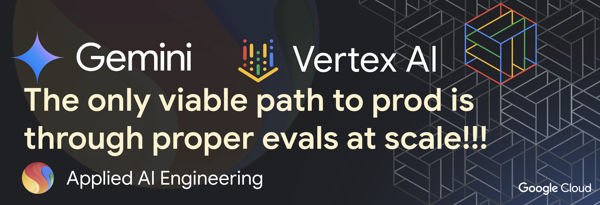
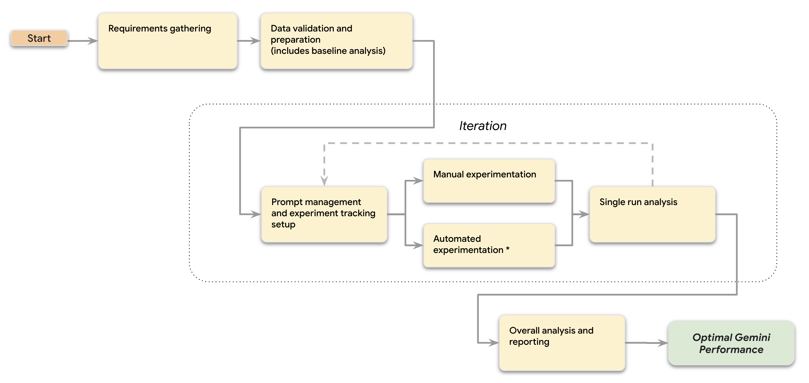
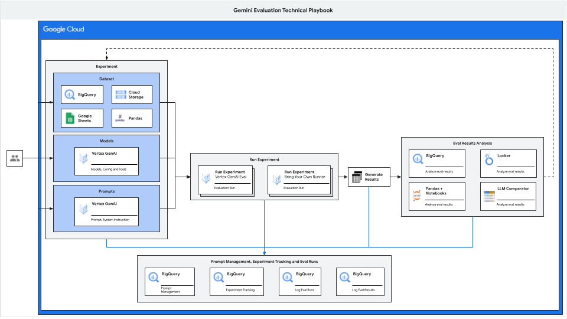

<h1 align="center">Vertex AI: Gemini Evaluations Playbook</h1>
<h3 align="center">Experiment, Evaluate & Analyze model performance for your use cases</h3>

## ✨ Overview

The **Gemini Evaluations Playbook** provides recipes to streamline the experimentation and evaluation of Generative AI models for your use cases using [Vertex Generative AI Evaluation service](https://cloud.google.com/vertex-ai/generative-ai/docs/models/evaluation-overview). This enables you to track and align model performance with your objectives, while providing insights to optimize the model under different conditions and configurations.

## 📏 Experimentation and evaluation workflow

[Prompting strategies and best practices](https://cloud.google.com/vertex-ai/generative-ai/docs/learn/prompts/prompt-design-strategies) are essential for getting started with Gemini, but they're only the first step. To ensure your Generative AI solution with Gemini delivers repeatable and scalable performance, you need a systematic experimentation and evaluation process. This involves meticulous tracking of each experimental configuration, including prompt templates (system instructions, context, and few-shot learning examples), and model parameters like temperature and max output tokens.

Your evaluation should go beyond overall results and report granular metrics for each experiment and not just final results for the evaluation exercise.

By following this process, you'll not only maximize your GenAI solution's performance but also identify anti-patterns and system-level design improvements early on. This proactive approach is far more efficient than discovering issues after deployment.



> [!NOTE]
> Refer [here](https://developers.googleblog.com/en/enhance-your-prompts-with-vertex-ai-prompt-optimizer/) for adding automation to your experimentation workflow with the Vertex AI Prompt Optimizer.

## 📏 Architecture

The following diagram depicts the architecture of the Gemini Evaluations Playbook. The architecture leverages 
 - Vertex Generative AI Evaluation service for running evaluations
 - Google BigQuery for logging prompts, experiments and eval runs.



## 🧩 Key Features

The Gemini Evaluations Playbook (referred as Evals Playbook) provides following key features:

<details>
<summary>✅ Define, track and compare experiments</summary>
Define and track a hierarchical structure of tasks, experiments, and evaluation runs to systematically organize and track your evaluation efforts. </details>
<details><summary>✅ Log evaluation results with prompts and responses</summary>
Manage and log experiment configurations and results to BigQuery, enabling comprehensive analysis. <br>
</details>
<details><summary>✅ Customize evaluation runs</summary>
Customize evaluations by configuring prompt templates, generation parameters, safety settings, and evaluation metrics to match your specific use case.
</details>
<details><summary>✅ Comprehensive Metrics</summary>
Track a range of built-in and custom metrics to gain a holistic understanding of model performance. <br>
</details>
<details><summary>✅ Iterative refinement</summary>
Analyze insights from evaluation to iteratively refine prompts, model configurations, and fine-tuning to achieve optimal outcomes. <br>
</details>

## 🏁 Getting Started

### STEP 1. Clone the repository
   
```shell
git clone https://github.com/GoogleCloudPlatform/applied-ai-engineering-samples.git && cd applied-ai-engineering-samples/genai-on-vertex-ai/gemini/evals_playbook
```

### STEP 2. Prepare your environment

Start with [0_gemini_evals_playbook_setup](notebooks/0_gemini_evals_playbook_setup.ipynb) notebook  to install required libraries (using Poetry) and configure the necessary resources on Google Cloud. This includes setting up a BigQuery dataset and saving [configuration parameters](config.ini).

### STEP 3. Experiment, evaluate, and analyze

Run the [1_gemini_evals_playbook_evaluate](notebooks/1_gemini_evals_playbook_evaluate.ipynb) notebook to design experiments, assess model performance on your generative AI tasks, and analyze evaluation results including side-by-side comparison of results across different experiments and runs.

### STEP 4. Optimize with grid search

Run the [2_gemini_evals_playbook_grid_search](notebooks/2_gemini_evals_playbook_gridsearch.ipynb) notebook to systematically explore different experiment configurations  by testing various prompt templates or model settings (like temperature), or combinations of these using a grid-search style approach.


## 🧬 Repository Structure 

```shell
.
├── bigquery_sqls
  └── evals_bigquery.sql
└── docs
└── notebooks
  └── 0_gemini_evals_playbook_setup.ipynb
  └── 1_gemini_evals_playbook_evaluate.ipynb
  └── 2_gemini_evals_playbook_gridsearch.ipynb
└── utils
  └── config.py
  └── evals_playbook.py
└── config.ini
└── pyproject.toml

```

<details>
<summary>Navigating repository structure</summary>

- [`/evals_bigquery.sql`](/utils/evals_bigquery.sql): SQL queries to create BigQuery datasets and tables
- [`/notebooks`](/notebooks): Notebooks demonstrating the usage of Evals Playbook
- [`/utils`](/utils): Utility or helper functions for running notebooks
- [`/congig.ini`](/config.ini): Save and reuse configuration parameters created in[0_gemini_evals_playbook_setup](/notebooks/0_gemini_evals_playbook_setup.ipynb)
- [`/docs`](/docs): Documentation explaining key concepts

</details>


## 📄 Documentation

* [Evals Playbook usage](notebooks)
* [`Architecture`](#-architecture)
* [`Data Schema`](docs/data_schema.md)

## 🚧 Quotas and limits

Verify you have sufficient quota to run experiments and evaluations:
- [BigQuery quotas](<https://cloud.google.com/bigquery/quotas>)
- [Vertex AI Gemini quotas](<https://cloud.google.com/vertex-ai/generative-ai/docs/quotas>)


## 🪪 License

Distributed with the [Apache-2.0 license](<LICENSE>). 

Also contains code derived from the following third-party packages:
* [Python](<https://www.python.org/>)
* [pandas](<https://pandas.pydata.org/>)
* [LLM Comparator](<https://github.com/PAIR-code/llm-comparator/tree/main>)

## 🙋 Getting Help

If you have any questions or if you found any problems with this repository, please report through GitHub issues.
